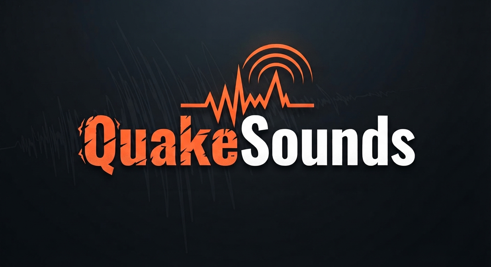

[QuakeSounds Live](https://cannerycoders.github.io/QuakeSounds/)

## info

`QuakeSounds` produces an ambient soundscape representing the live earthquakes as provided by the USGS earthquake hazards program.
It can be used as a comforting and sometimes alarming background in your daily grind.

`QuakeSounds` requires big speakers and therefore isn't suitable for running on mobile devices.

`QuakeSounds` also demonstrates the plumbing required to embed [HzWeb](https://cannerycoders.com/Hz) sound-engine into your web-app.

## credits

`QuakeSounds` was built by [Cannery Coders](https://cannerycoders.com). It leverages the open-source packages,  `global-three` and `three.js`.

`USGS` offers valuable services courtesy of the US Government.

## caveats

See [LICENSE.md](LICENSE.md).
